# 🛒 eCommerce App with Firebase Integration

This **eCommerce app** allows users to browse products, manage their favorites, place orders, make payments, and write reviews. Built with **Firebase** for backend services such as authentication, product storage, and order management, the app offers a seamless shopping experience with real-time updates.


---

## 📱 Features

- **User Authentication**: Secure login and registration using Firebase Authentication.
  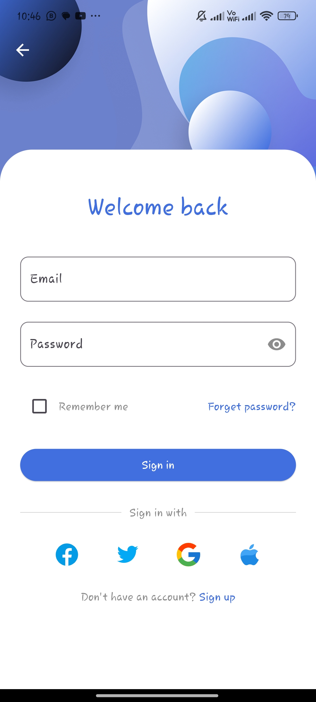
  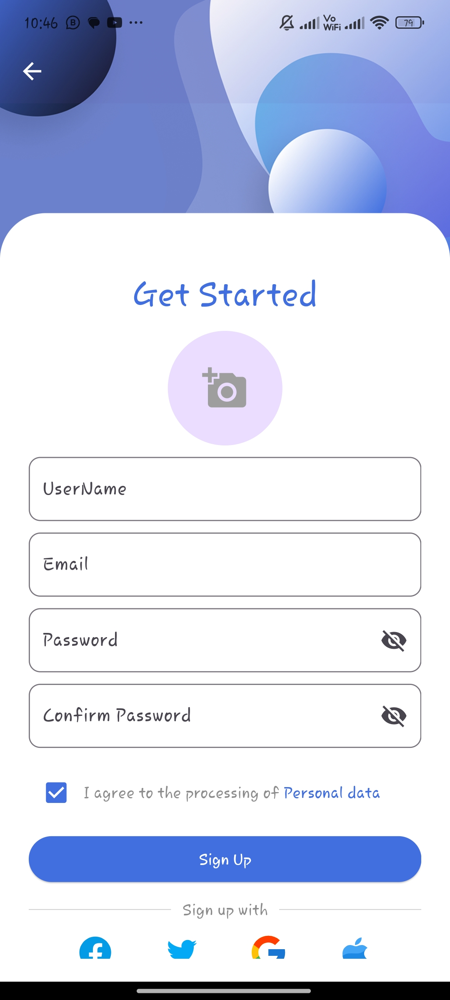

- **Product Management**: Browse, search, and filter products. Users can add products to their favorites and cart.
  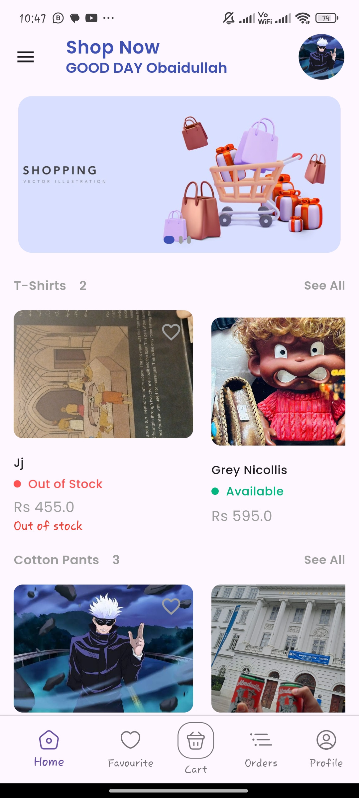
  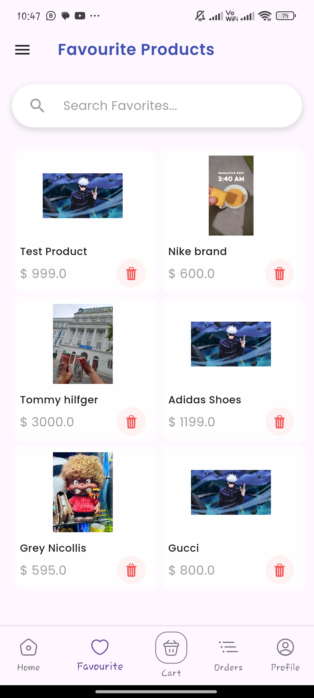

- **Cart and Orders**: Users can add products to their cart, view order summaries, and place orders with integrated payment processing.
  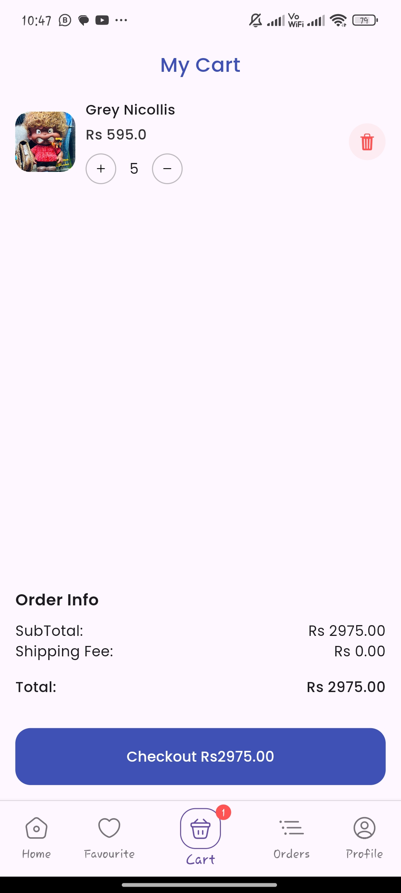
  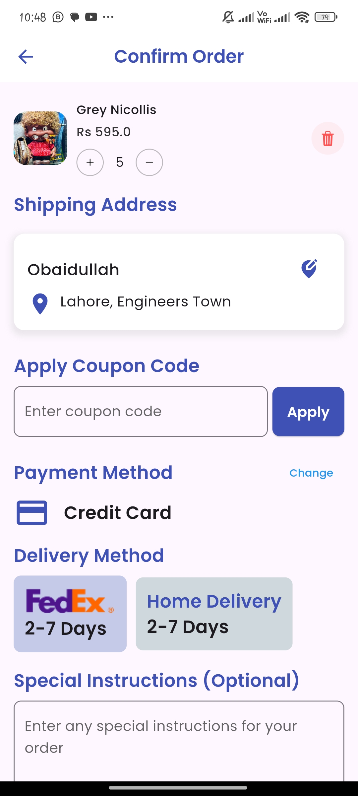

- **Payments**: Secure payments via Firebase, with real-time order status updates.
  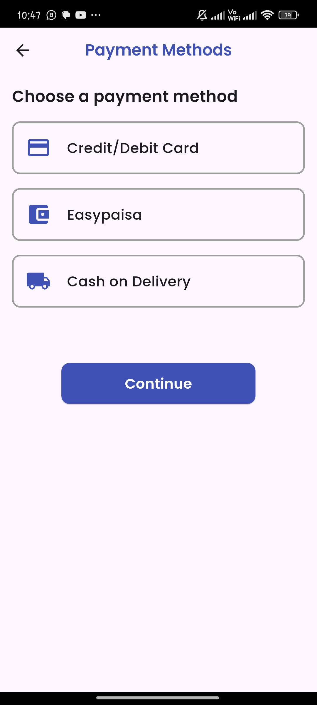

- **Reviews and Ratings**: Users can write reviews and rate products. They can also view reviews from other users.
  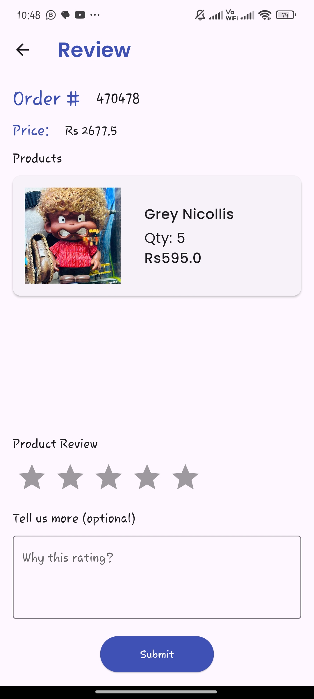
  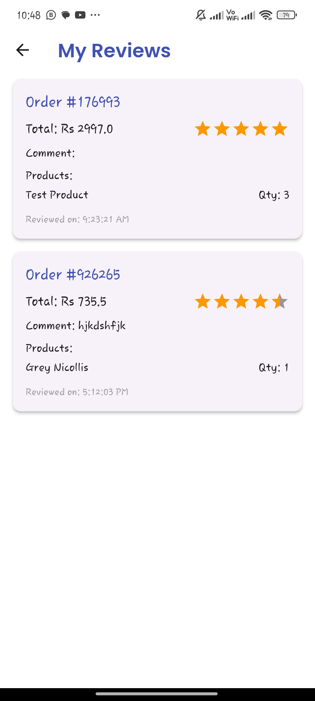

- **Dark Mode**: Full dark mode support for a better user experience.
  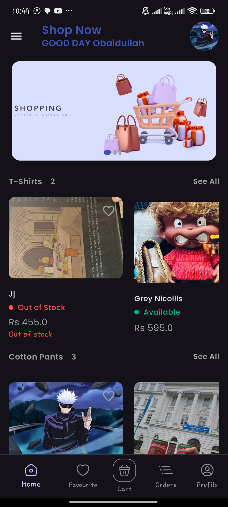
  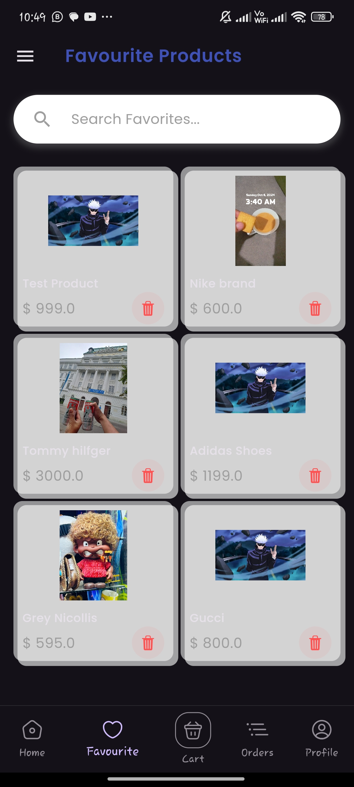

---

## 📸 Screenshots

| Splash Screen       | Welcome Screen      | Login Screen        |
|---------------------|---------------------|---------------------|
| 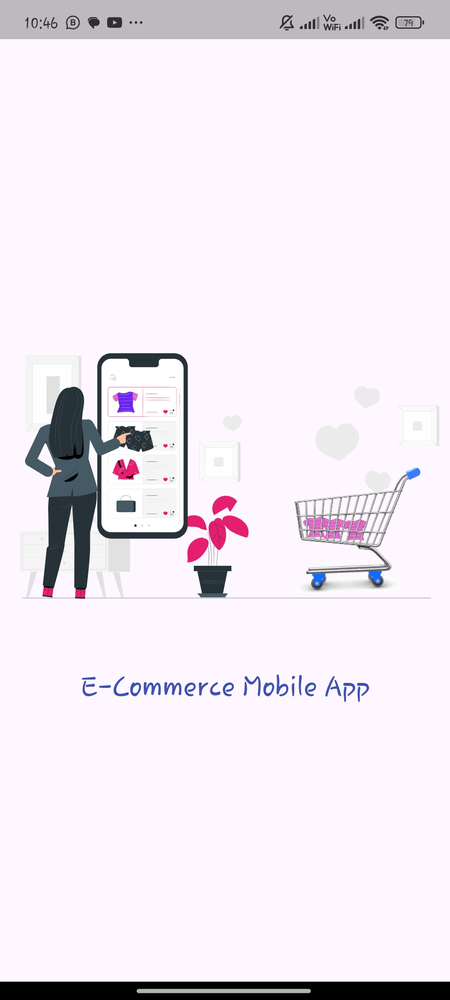 | 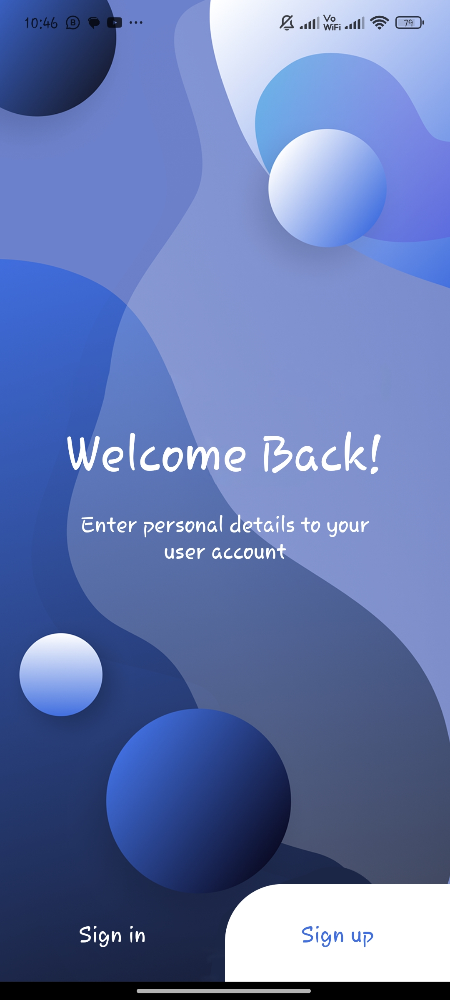 |  |

| Home Screen         | Cart Screen         | Confirm Order       |
|---------------------|---------------------|---------------------|
|      | 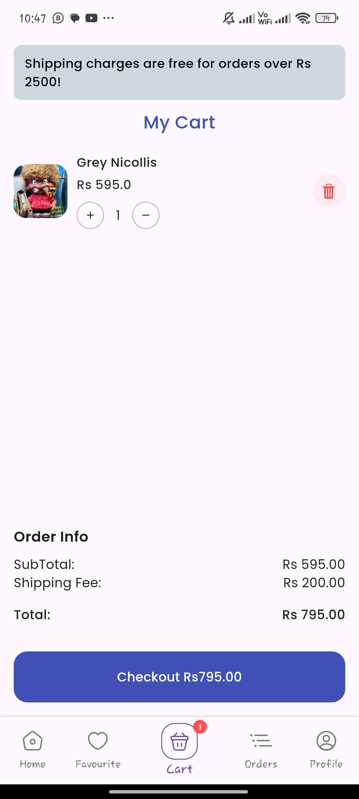 |  |

| Payment Screen      | Order List          | Profile Screen      |
|---------------------|---------------------|---------------------|
|      | 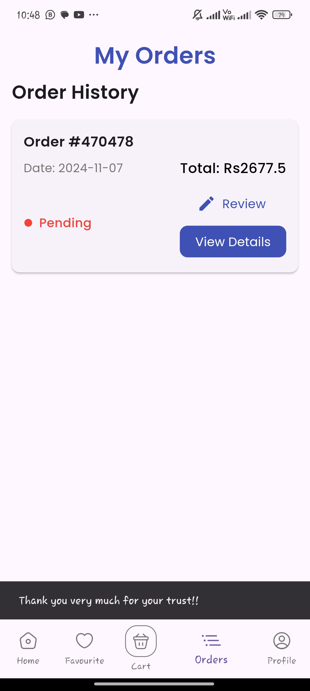 | 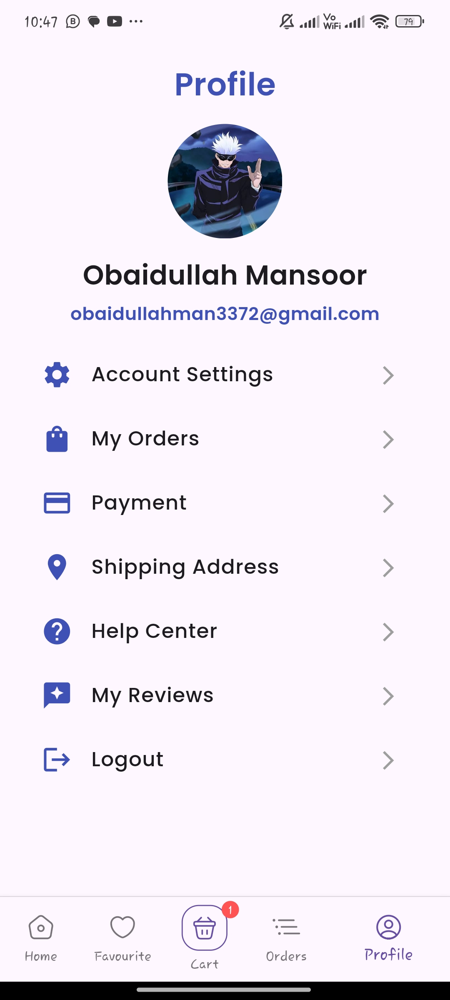 |

| Dark Mode Home      | Dark Mode Order List| Dark Mode Review    |
|---------------------|---------------------|---------------------|
|          | 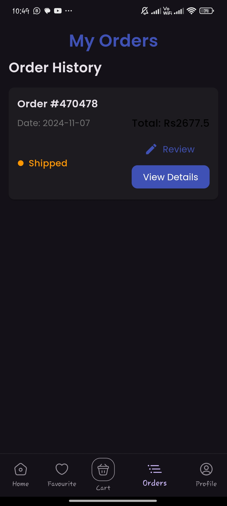 | 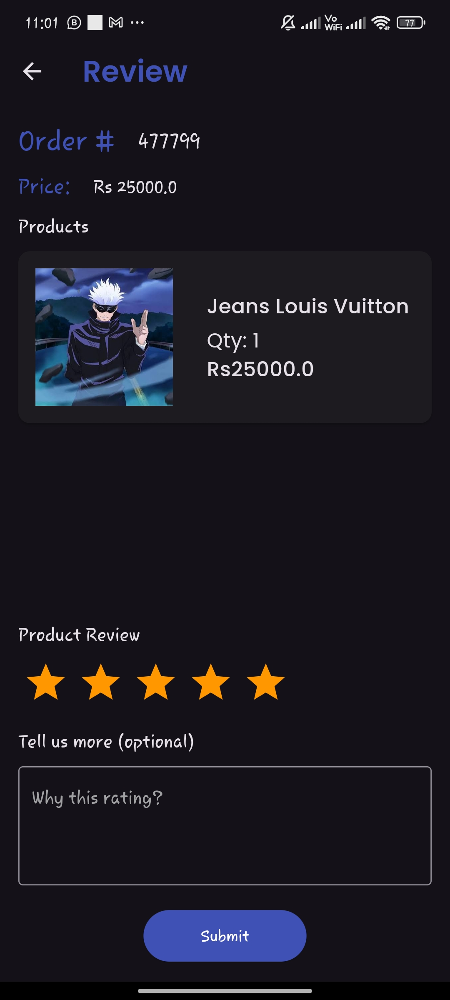 |

---

## 🛠️ Built With

- **Flutter**: Cross-platform mobile framework for building high-performance apps.
- **Firebase**: Backend services for authentication, product storage, orders, payments, and reviews.
- **Lottie**: Smooth animations for splash screens and payment processing.
  
  Example Lottie animations used:
  - **Splash Screen Animation**: `assets/splash.json`
  - **Payment Processing Animation**: `assets/paymentprocessing.json`
  - **Payment Success Animation**: `assets/paymentdone.json`
  - **Forgot Password Animation**: `assets/forgotpass.json`

---

## 📂 Project Structure

```plaintext
ecommerceapp/
│
├── lib/
│   ├── main.dart                  # Entry point of the app
│   ├── screens/                   # Screens like Login, Home, Cart, Order, etc.
│   ├── services/                  # Firebase services for authentication, product, order, and payment management
│   ├── models/                    # Data models for Product, User, Order, Review, etc.
│   └── widgets/                   # Reusable UI components like buttons, forms, etc.
├── assets/                        # App assets (images, Lottie animations)
├── pubspec.yaml                   # Project dependencies
└── README.md                      # Project documentation
```

---

## 🚀 How to Run Locally

1. **Clone the repository**:
   ```bash
   git clone https://github.com/obaidullah72/ecommerceapp.git
   cd ecommerceapp
   ```

2. **Install dependencies**:
   ```bash
   flutter pub get
   ```

3. **Set up Firebase**:
   - Follow the [Firebase Setup Guide](https://firebase.google.com/docs/flutter/setup) to configure Firebase for your app.
   - Download the `google-services.json` (for Android) or `GoogleService-Info.plist` (for iOS) from the Firebase Console and add it to the respective platforms.

4. **Run the app**:
   ```bash
   flutter run
   ```

---

## 🚀 Future Enhancements

- **Push Notifications**: Real-time notifications for order status and updates.
- **Wishlist Feature**: Add products to a wishlist for future purchases.
- **Discounts and Coupons**: Support for promo codes and discount offers.
- **Localization**: Support for multiple languages.

---

## 🤝 Contributing

We welcome contributions! Feel free to submit a **pull request** or open an issue to discuss potential improvements.

---

## 🛡️ License

This project is licensed under the **MIT License** – see the [LICENSE](LICENSE) file for details.

---

## 📬 Contact

For any questions or suggestions, feel free to reach out:

- **GitHub**: [obaidullah72](https://github.com/obaidullah72)
- **LinkedIn**: [obaidullah72](https://www.linkedin.com/in/obaidullah72/)

---

[](https://visitcount.itsvg.in)
